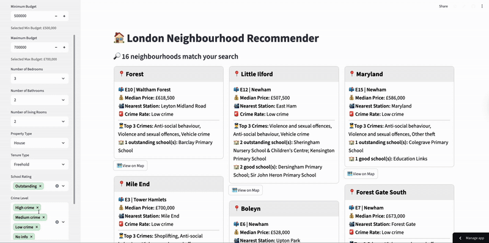

# 🏠 Find My Hood - London Neighbourhood Recommender System
A Streamlit dashboard for exploring London neighbourhoods by budget, property criteria, crime rate, and school quality.  

Author: Eunkyung Cha  
Supervisor: Dr. Fabrizio Smeraldi  
Institution: Queen Mary University of London  

---

This repository contains two main parts:  
1. Data processing  
2. Streamlit dashboard  

The code references two external services: **Postcodes.io** and **Google Geocoding**. No API keys are committed.   
Users must supply their own keys where applicable or load cache that is already available.

## Launch App
Click the button below to open the interactive dashboard:
[](https://chaek0115-london-neighbourhood-recommendat-streamlit-app-kxwju5.streamlit.app/)


---

## Repository structure

| File / Folder                   | Description                                                                 |
|---------------------------------|-----------------------------------------------------------------------------|
| `sample/`                       | Contains all sample-mode assets including:                                  |
|                                 | └── `data_sample/` – Small excerpts of the original datasets (10 rows each) |
|                                 | └── `data_sample_processed/` – imtermediate processed files will be saved here.             |
|                                 | └── `data_processing_sample.ipynb` – Sample-mode Jupyter Notebook for sample datasets              |
| `final_data/`                   | Fully processed dataset used by the main dashboard                          |
| `data_processing.ipynb`         | Full data processing notebook using original datasets                       |
| `api_geocode.py`                | Python module for calling the Google Geocoding API           |
| `api_geocode.cpython-310.pyc`   | Auto-generated|
| `streamlit_app.py`              | Main Streamlit app to launch the dashboard                             |
| `geocode_cache.json`            | Cached geocoding results to reduce API usage                                |
| `images/`                       | GIFs for demo in README                                  |
| `README.md`                     | Project overview and manual guide                                    |

---

## Prerequisites
- Python 3.10+  
- [Streamlit](https://streamlit.io/)  
- [Postcodes.io](https://postcodes.io/) (free, no key required)
- [Google Geocoding API](https://developers.google.com/maps/documentation/geocoding) – **Requires a personal API key**  

---

## 1) Data processing

**Goal**  
Combine multiple public datasets into one file keyed by the unique combination of `outcode`(= outward code) and `ward`(= neighbourhood area), with property attributes aggregated to median price and contextual metrics attached.

**Sources used**  
- House price data (sales only) – [UK House Price Data](https://www.gov.uk/government/statistical-data-sets/price-paid-data-downloads), 2024
- Crime counts – [data.police.uk](https://data.police.uk/) 2024, City of London and Metropolitan police forces
- Ofsted school ratings – [Ofsted Reports](https://reports.ofsted.gov.uk/), 2024
- Postcode and population data – [ONS Postcode Directory](https://geoportal.statistics.gov.uk/), 2025

**APIs**
- **[Postcodes.io](https://postcodes.io/)** – Free and open-source UK postcode API used for reverse-mapping geographic coordinates to postcodes, retrieving outward codes.  
- **[Google Geocoding API](https://developers.google.com/maps/documentation/geocoding
)** – Converts addresses or area names into geographic coordinates and vice versa. **Requires a personal API key.**


**Methods used**  
- Normalise location fields so all sources share the same location structure.  
  - Postcodes.io is used to reverse-map coordinates to postcodes. Then outcodes were extracted from postcodes.  
  - Google Geocoding API is used to obtain coordinates from `outcode` + `ward` at the end of processing to use the map feature on the dashboard.  
- Merge on `outcode` + `ward`. Use **left joins** to keep all London areas present even when some contextual data are missing. Missing values appear as “No information”.  
- Aggregate property records by `outcode` + `ward` + property filters (bedrooms, bathrooms, living rooms, tenure, property type) to compute `median_price`.  
- Compute `crime_per_1000` as `crime_count / population * 1000` for a consistent crime metric.

---

## 2) Streamlit dashboard

### Running locally with sample data (no API key needed)
1. Clone the repository:
   ```bash
   git clone https://github.com/chaek0115/london_neighbourhood_recommendation_dashboard.git
   cd london_neighbourhood_recommendation_dashboard

2. Run the app:
    ```bash
   streamlit run streamlit_app.py
    ```
---

## How to Test Data Processing

The data processing can be tested with sample data (10 rows each) and full postcode data. These can be found in the `sample/` folder. 
Testing for Streamlit Dashboard is not available, as sample data will not be sufficient for Streamlit to function well.
To see how the dashboard works, visit the dashboard link embedded in the Launch App section.

### Steps:
1. **Use the sample datasets**  
   The `sample/` folder contains excerpts from each original dataset (house prices, crime, schools, postcode/population).

2. **(Optional) Create your Google Geocoding API key**  
   Sign up for the Google Cloud Geocoding API and save your key in a `.env` file in the project root:  
   ```bash
   GOOGLE_API_KEY=your_personal_api_key_here
   ```
	If you don’t want to use an API key, you can run the notebook with cached geocoding results for the sample data. The cached geocoding is already available.

4. **Install required libraries**
Install libraries on Terminal if they are not installed already. 
 ```bash
  pip install pandas numpy requests tqdm geopy python-dotenv streamlit
  ```
4. **Run the sample data processing notebook**
	•	Open data_processing_sample.ipynb in Jupyter Notebook.
	•	This processes all sample CSVs and outputs a processed dataset in `data_sample_processed/`.

---
## Key Features

- **Budget Filtering**  
  Easily filter neighbourhoods by minimum and maximum property price.

- **Property Filters**  
  Refine your search based on:
  - Number of bedrooms  
  - Number of bathrooms  
  - Number of living rooms  
  - Tenure type (`freehold`,`leasehold`,`feudal`,`shared`)  
  - Property type (`flat`,`house`,`bungalow`,`other`)

- **Crime Rate and School Quality Filters**  
  Limit areas by crime rate and Ofsted school ratings.

- **Map Integration**  
  Each result card includes a direct link to a map.

- **Independent Filters**  
  All filters work independently and can be applied in any order.

- **Session State**  
  The dashboard remembers your most recent filter settings until the page is refreshed.

---

## Known Limitations

- No user authentication or saved searches.
- Commute-time calculation and filter are not available.
- The layout is optimised for desktop but not for mobile browsers.
